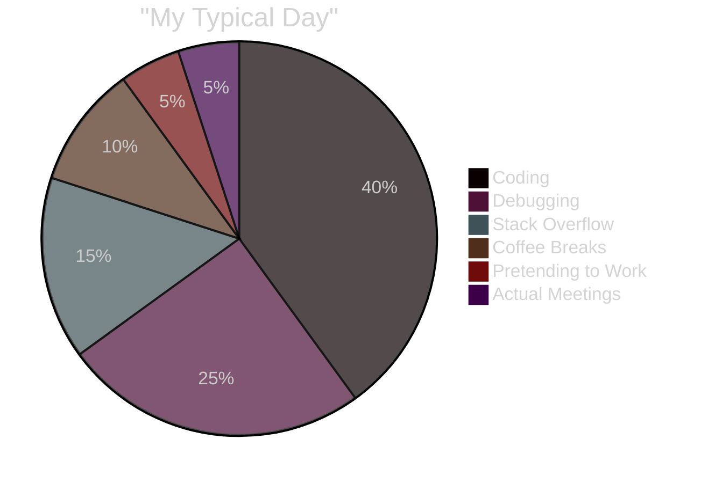

<div align="center">

<!-- EPIC ANIMATED HEADER -->


<!-- MATRIX RAIN EFFECT VIBES -->
```
███████╗██╗  ██╗ █████╗ ██╗  ██╗██╗██╗     
██╔════╝██║  ██║██╔══██╗██║ ██╔╝██║██║     
███████╗███████║███████║█████╔╝ ██║██║     
╚════██║██╔══██║██╔══██║██╔═██╗ ██║██║     
███████║██║  ██║██║  ██║██║  ██╗██║███████╗
╚══════╝╚═╝  ╚═╝╚═╝  ╚═╝╚═╝  ╚═╝╚══════╝
```

<!-- MEGA ANIMATED TYPING -->


<!-- ANIMATED SUBTITLE -->


---

### 🎮 TERMINAL STATUS


<!-- ANIMATED DIVIDER -->


---

## 🌟 SHAKIL.EXE — SYSTEM OVERVIEW


<table>
<tr>
<td width="50%">

### 🎯 CORE FUNCTIONS


</td>
<td width="50%">

### ⚡ POWER LEVELS


</td>
</tr>
</table>

<!-- ANIMATED CODING GIF -->


---

## 💻 TECH STACK — WEAPONS OF CHOICE


<div align="center">

### 🎨 Frontend Arsenal


### ⚙️ Backend & Cloud Fortress


### 📱 Mobile Dominance


### 🗄️ Database Kingdom


### 🛠️ Developer Toolkit


</div>

<!-- ANIMATED DIVIDER -->


---

## 📊 GITHUB BATTLEFIELD STATS


<div align="center">


</div>

<!-- ANIMATED DIVIDER -->


---

## 🏆 ACHIEVEMENT SHOWCASE


<div align="center">


<!-- CUSTOM ANIMATED BADGES -->


</div>

---

## 🎯 DAILY DEVELOPER ROUTINE


<div align="center">



</div>

<!-- SNAKE EATING CONTRIBUTIONS -->
<picture>
  <source media="(prefers-color-scheme: dark)" srcset="https://raw.githubusercontent.com/shakil-flash/shakil-flash/output/github-contribution-grid-snake-dark.svg">
  <source media="(prefers-color-scheme: light)" srcset="https://raw.githubusercontent.com/shakil-flash/shakil-flash/output/github-contribution-grid-snake.svg">
  
</picture>

---

## 💭 DEVELOPER WISDOM


<div align="center">


### 🎲 RANDOM DEV JOKE


</div>

---

## 🎨 CURRENT VIBES


<div align="center">

| 🎧 Currently Listening | 📚 Currently Learning | 🎮 Currently Playing |
|:---:|:---:|:---:|
|  |  |  |

</div>

---

## 🔥 FUN FACTS ABOUT ME


<table align="center">
<tr>
<td>

### 😈 Developer Life


</td>
<td>

### ⚡ Power Stats


</td>
</tr>
</table>

---

## 📡 CONNECT WITH ME


<div align="center">

### 🌐 Social Links

<a href="https://github.com/shakil-flash">

</a>
<a href="https://linkedin.com">

</a>
<a href="mailto:your@email.com">

</a>
<a href="https://twitter.com">

</a>
<a href="https://discord.com">

</a>
<a href="https://portfolio.com">

</a>

### 📈 VISITOR COUNT


</div>

---

<!-- ANIMATED FOOTER -->
<div align="center">

### 💬 FINAL WORDS


```ascii
╔═══════════════════════════════════════════════════════════╗
║                                                           ║
║  "Code is like humor. When you have to explain it,       ║
║   it's bad." — Cory House                                ║
║                                                           ║
║  💡 Building the future, one commit at a time            ║
║  🚀 Open to collaboration & new opportunities            ║
║  ⚡ Let's create something awesome together!             ║
║                                                           ║
╚═══════════════════════════════════════════════════════════╝
```


### ⭐ If you like my work, consider giving a star! ⭐


</div>

<!-- EPIC ANIMATED FOOTER -->


</div>
