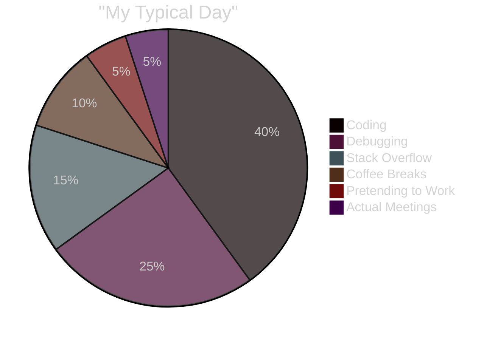

<div align="center">

<!-- EPIC ANIMATED HEADER -->


<!-- MATRIX RAIN EFFECT VIBES -->
```
███████╗██╗  ██╗ █████╗ ██╗  ██╗██╗██╗     
██╔════╝██║  ██║██╔══██╗██║ ██╔╝██║██║     
███████╗███████║███████║█████╔╝ ██║██║     
╚════██║██╔══██║██╔══██║██╔═██╗ ██║██║     
███████║██║  ██║██║  ██║██║  ██╗██║███████╗
╚══════╝╚═╝  ╚═╝╚═╝  ╚═╝╚═╝  ╚═╝╚═╝╚══════╝
    [ FULL-TIME APP ARCHITECT | CODE SORCERER ]
```

<!-- CYBERPUNK TYPING ANIMATION -->


---

### 🎮 TERMINAL STATUS

```bash
$ whoami
> shakil-flash: Full-Stack Sorcerer & Mobile Magician

$ cat /etc/motd
> ⚡ Coding since the dark ages (2020)
> 🔥 99 problems but a bug ain't one (it's 127)
> ☕ Coffee-to-Code converter: 100% efficiency
> 🌙 Dark mode enthusiast | Light mode = eye damage

$ uptime
> 🔋 System online: 24/7/365 | Sleep mode: deprecated
```

<!-- ANIMATED DIVIDER -->


---

## 🌟 SHAKIL.EXE — SYSTEM OVERVIEW

<table>
<tr>
<td width="50%">

### 🎯 CORE FUNCTIONS
```javascript
const shakil = {
  role: "Full-Stack Developer",
  language: "JavaScript, Dart, Python",
  frameworks: ["Flutter", "React", "Node.js"],
  database: ["Firebase", "MongoDB", "MySQL"],
  currentMission: "Building apps that slap 💥",
  funFact: "I debug with console.log like a boss"
};
```

</td>
<td width="50%">

### ⚡ POWER LEVELS
```python
skills = {
    "Frontend Magic": "████████░░ 85%",
    "Backend Wizardry": "███████░░░ 78%",
    "Mobile Sorcery": "█████████░ 92%",
    "Coffee Addiction": "██████████ 100%",
    "Bug Creation": "█░░░░░░░░░ 10%",
    "Bug Fixing": "█████████░ 90%"
}
```

</td>
</tr>
</table>

<!-- ANIMATED CODING GIF -->


---

## 💻 TECH STACK — WEAPONS OF CHOICE

<div align="center">

### 🎨 Frontend Arsenal


### ⚙️ Backend & Cloud Fortress


### 📱 Mobile Dominance


### 🗄️ Database Kingdom


### 🛠️ Developer Toolkit


</div>

<!-- ANIMATED DIVIDER -->


---

## 📊 GITHUB BATTLEFIELD STATS

<div align="center">


</div>

<!-- ANIMATED DIVIDER -->


---

## 🏆 ACHIEVEMENT SHOWCASE

<div align="center">


<!-- CUSTOM BADGES -->


</div>

---

## 🎯 DAILY DEVELOPER ROUTINE

<div align="center">



</div>

<!-- SNAKE EATING CONTRIBUTIONS -->
<picture>
  <source media="(prefers-color-scheme: dark)" srcset="https://raw.githubusercontent.com/shakil-flash/shakil-flash/output/github-contribution-grid-snake-dark.svg">
  <source media="(prefers-color-scheme: light)" srcset="https://raw.githubusercontent.com/shakil-flash/shakil-flash/output/github-contribution-grid-snake.svg">
  
</picture>

---

## 💭 DEVELOPER WISDOM

<div align="center">


### 🎲 RANDOM DEV JOKE


</div>

---

## 🎨 CURRENT VIBES

<div align="center">

| 🎧 Currently Listening | 📚 Currently Learning | 🎮 Currently Playing |
|:---:|:---:|:---:|
| Lofi Hip Hop Radio 24/7 | Web3 & Blockchain | Life (Hard Mode) |
| Synthwave Beats | AI/ML Algorithms | Chess (still losing) |
| Epic Coding Playlists | System Design | The Debugging Game |

<!-- SPOTIFY NOW PLAYING (Optional - needs setup) -->
<!--  -->

</div>

---

## 🔥 FUN FACTS ABOUT ME

<table align="center">
<tr>
<td>

### 😈 Developer Life

- 👨‍💻 I speak fluent JavaScript, Python, and Sarcasm
- 🐛 My code doesn't have bugs, just undocumented features
- ☕ Powered by coffee, Stack Overflow & pure spite
- 🌙 I'm more productive at 3 AM than 3 PM
- 🔁 "Quick fix" = 4 hours later
- 💀 Merge conflicts are my cardio
- 🎯 100% uptime (except when debugging)

</td>
<td>

### ⚡ Power Stats

```javascript
while (alive) {
  eat();
  sleep(4); // hours
  code();
  repeat();
}

// Error: sleep is not defined
// Solution: more coffee ☕
```


</td>
</tr>
</table>

---

## 📡 CONNECT WITH ME

<div align="center">

### 🌐 Find Me Across The Internet

<a href="https://github.com/shakil-flash">

</a>
<a href="https://linkedin.com">

</a>
<a href="mailto:your@email.com">

</a>
<a href="https://twitter.com">

</a>
<a href="https://discord.com">

</a>
<a href="https://portfolio.com">

</a>

### 📈 VISITOR COUNT


</div>

---

<!-- ANIMATED FOOTER -->
<div align="center">

### 💬 FINAL WORDS

```ascii
╔═══════════════════════════════════════════════════════════╗
║                                                           ║
║  "Code is like humor. When you have to explain it,       ║
║   it's bad." — Cory House                                ║
║                                                           ║
║  💡 Building the future, one commit at a time            ║
║  🚀 Open to collaboration & new opportunities            ║
║  ⚡ Let's create something awesome together!             ║
║                                                           ║
╚═══════════════════════════════════════════════════════════╝
```


### ⭐ If you like my work, consider giving a star! ⭐


</div>

<!-- EPIC ANIMATED FOOTER -->


</div>
